# 🛒 Ecommerce Microservices Backend

A production-grade event-driven microservices e-commerce backend built with Spring Boot, Kafka, Eureka, and API Gateway.

## 🏗️ Architecture





## ⚙️ Tech Stack

- **Backend**: Java 21, Spring Boot 3.5
- **Messaging**: Apache Kafka (event-driven)
- **Service Discovery**: Netflix Eureka
- **API Gateway**: Spring Cloud Gateway
- **Database**: PostgreSQL (per service)
- **Cache**: Redis
- **Migrations**: Flyway
- **Tracing**: Zipkin
- **Containerization**: Docker + Docker Compose

## 🔑 Services

| Service | Port | Description |
|---------|------|-------------|
| API Gateway | 8080 | Single entry point |
| User Service | 8081 | Auth + JWT |
| Product Service | 8082 | Product catalog |
| Order Service | 8083 | Order management |
| Payment Service | 8084 | Payment processing |
| Notification Service | 8085 | Event notifications |

## 📦 Key Features

- ✅ JWT Authentication
- ✅ Event-driven with Kafka (order → payment → notification)
- ✅ Service discovery with Eureka
- ✅ Database per service pattern
- ✅ Flyway DB migrations
- ✅ Distributed tracing with Zipkin
- ✅ Docker Compose full setup

## 🚀 How to Run

### Prerequisites
- Java 21
- Maven
- Docker Desktop

### Steps

```bash
# Clone
git clone https://github.com/shree9491/ecommerce-microservices.git
cd ecommerce-microservices

# Start infrastructure
docker-compose up -d

# Create databases
docker exec -it user_postgres psql -U postgres -c "CREATE DATABASE user_db;"
docker exec -it product_postgres psql -U postgres -c "CREATE DATABASE product_db;"
docker exec -it order_postgres psql -U postgres -c "CREATE DATABASE order_db;"
docker exec -it payment_postgres psql -U postgres -c "CREATE DATABASE payment_db;"

# Run each service
cd user-service && mvn spring-boot:run
cd product-service && mvn spring-boot:run
cd order-service && mvn spring-boot:run
cd payment-service && mvn spring-boot:run
cd notification-service && mvn spring-boot:run
cd api-gateway && mvn spring-boot:run
```

## 🧪 Test the Flow

```bash
# 1. Register
POST http://localhost:8080/api/auth/register

# 2. Login
POST http://localhost:8080/api/auth/login

# 3. Browse Products
GET http://localhost:8080/api/products

# 4. Place Order
POST http://localhost:8080/api/orders

# 5. Check Payment
GET http://localhost:8080/api/payments
```

## 📊 Event Flow

Order Created

↓ Kafka: order.created

Payment Service processes payment

↓ Kafka: payment.success / payment.failed

Notification Service sends confirmation

↓

Order status updated to COMPLETED/FAILED


## 👨‍💻 Author

**Sai Krishna** — [GitHub](https://github.com/shree9491)